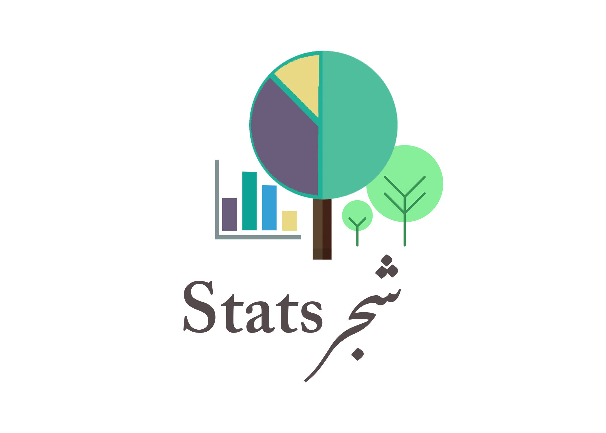

# Shajr Stats

Scans satelite imagery to generate data driven dashboards regarding the vegetation greenery of Pakistan
On a mission to *#MakePakistanGreenAgain*

# Demo

## [Url](https://youtu.be/GpxSCJHqFtY)

# Usage
`source venv/bin/activate`
`flask run app`

## Dependencies
- Flask
- Pandas
- Gunicorn

# Application Link:

Deployed on [Heroku](https://shajr-stats.herokuapp.com)

